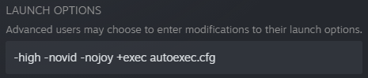

# csgo_config
This config features various quality-of-life settings and key bindings. Inspired by and created with the help of friends and the community. Thanks everyone!

[Right click here](autoexec.cfg?raw=true) and choose `Save link as...` to download the config file.

[How to install?](#installation)

## Fast grenades
| Grenade     | Equip     | Buy         |
| ----------- | --------- | ----------- |
| Flash       | `Mouse 4`   | `Arrow Right` |
| Molotov     | `X`         | `Arrow Down`  |
| HE Grenade  | `C`         | `Arrow Up`    |
| Smoke       | `V`         | `Arrow Left`  |

## Useful bindings
- `ALT`   Voice
- `Q` Quickswap
- `H` Jumpthrow
- `Mouse Wheel` Bunnyhop
- `J` Show bomb in smoke
- `Z` and `G` Drop
- `Mouse 5` Drop Bomb

## Quick Shop
- ` NUM 0`  Vest
- ` NUM .`  Vest + Helmet
- ` NUM 1`  AK / M4
- ` NUM 2`  P250
- ` NUM 3`  AWP
- ` NUM 4`  Galil / Famas
- ` NUM 5`  Scout
- ` NUM +`  Tec / Five-Seven / CZ
- ` NUM *`  Defuse Kit

## Various features
- `W` `A` `S` `D` and `Shift` also clear decals.
- `TAB` also displays accurate net graph.
- Full map radar. Hold `F` to zoom in.
- Viewmodel settings to make weapons take less screen space.
- Bright gamma for better visibility in the dark.
- A good crosshair.
- Damage done shown at the end of the round.
- Various minor features.

# Installation
Right click `CS:GO` and click `Properties`:

Click `Local Files` and `Browse`.

> ℹ️ While you are here you may as well add these launch options:
> 
> `-high -novid -nojoy`
> 
> These will make the game launch in higher OS priority, the opening cutscene will be skipped, and controllers will not be polled.
> 
> 

Navigate to the folder `csgo`, then the folder `cfg`, and paste in the [config](autoexec.cfg?raw=true):

Press `~` in-game to open console, type in `exec autoexec` and press `Enter`:

Start using the new key bindings in your games!
