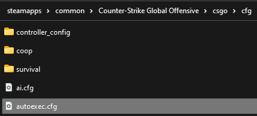

# csgo_config
This exec features various quality-of-life settings and bindings. Inspired and created with the help of friends and the CS:GO community. Thanks everyone!

[Right click here](https://raw.githubusercontent.com/lubomirkurcak/csgo_config/master/autoexec.cfg) and choose `Save link as...`

[How to install?](#installation)

## Fast grenades
| Grenade     | Equip     | Buy         |
| ----------- | --------- | ----------- |
| Flash       | `Mouse 4`   | `Arrow Right` |
| Molotov     | `X`         | `Arrow Down`  |
| HE Grenade  | `C`         | `Arrow Up`    |
| Smoke       | `V`         | `Arrow Left`  |

## Useful bindings
- `ALT`   Voice
- `Q` Quickswap
- `H` Jumpthrow
- `Mouse Wheel` Bunnyhop
- `J` Show bomb in smoke
- `Z` and `G` Drop
- `Mouse 5` Drop Bomb

## Quick Shop
- ` NUM 0`  Vest
- ` NUM .`  Vest + Helmet
- ` NUM 1`  AK / M4
- ` NUM 2`  P250
- ` NUM 3`  AWP
- ` NUM 4`  Galil / Famas
- ` NUM 5`  SSG08 (Scout)
- ` NUM 6`  UMP45
- ` NUM 7`  AUG / SG556
- ` NUM 8`  Auto Sniper
- ` NUM 9`  Mag / Sawed-off
- ` NUM +`  Tec / Five-Seven / CZ
- ` NUM *`  Defuse Kit
- ` NUM -`        Decoy
- ` Page Up`  Zeus

## Various features
- `W` `A` `S` `D` and `Shift` also clear decals.
- `TAB` also displays accurate net graph.
- Full map radar. Hold `F` to zoom in.
- Viewmodel settings to make weapons take less screen space.
- Bright gamma for better visibility in the dark.
- Damage done shown at the end of the round.
- Various minor features.
- `N` Equip taser.
- `M` Equip decoy.

# Installation
Right click `CS:GO` and click `Properties`:

Click `Local Files` and `Browse`.

Although while you're here you might as well add these launch options: `-high -novid -nojoy +exec autoexec.cfg`. The game will launch in higher OS priority, the opening cutscene is skipped, controllers will not be polled, and `autoexec.cfg` will be executed automatically allowing you to skip the final step.

Navigate to `csgo`:

Navigate to `cfg`:

Paste `autoexec.cfg`:

Enable console in settings:

Open console with `~`, type in `exec autoexec` and hit `ENTER`:

Done!

